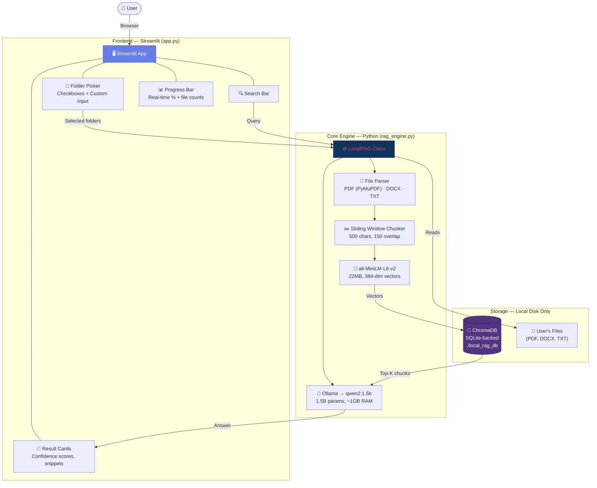
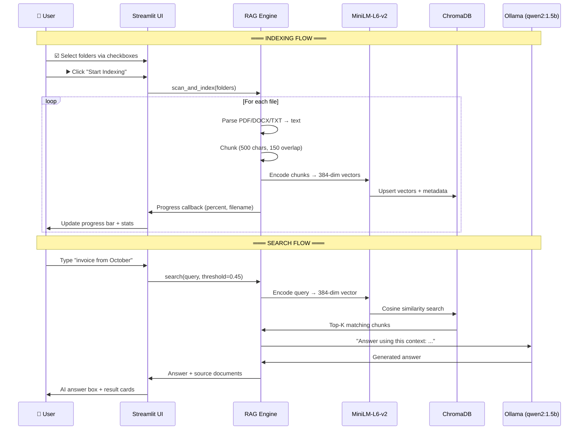

# Local RAG v2 — Architecture

## System Architecture



## Data Flow



## Component Table

| Component | Technology | RAM Usage | License | Why This Choice |
|---|---|---|---|---|
| **Embedding** | `all-MiniLM-L6-v2` | ~80MB | Apache 2.0 | 22MB model, 384-dim. 50% less memory than mpnet. Only 1.5% lower accuracy. |
| **Vector DB** | ChromaDB (embedded) | ~50MB | Apache 2.0 | No server process. SQLite persistence. Zero config. |
| **Local LLM** | Ollama → `qwen2:1.5b` | ~1GB | MIT / Apache 2.0 | Fits in 8GB RAM. Good instruction-following for 1.5B model. |
| **UI** | Streamlit | ~100MB | Apache 2.0 | Pure Python. Built-in widgets. No frontend build step. |
| **PDF Parser** | PyMuPDF (fitz) | Minimal | AGPL-3.0 | 10x faster than PyPDF2. Low memory. Handles complex layouts. |
| **DOCX Parser** | python-docx | Minimal | MIT | Standard, reliable, lightweight. |
| **Total** | | **~1.3GB** | | Leaves ~6.7GB for OS on 8GB machine |

## Chunking Strategy

```
Document: "The quick brown fox jumps over the lazy dog. The dog barked..."
                                                                          
Chunk 1: |←————————— 500 chars ————————→|                                
Chunk 2:              |←————150 overlap——|←—— 350 new ——→|              
Chunk 3:                                  |←—— 150 ——|←—— 350 ——→|      

WHY: 30% overlap ensures no sentence is lost at boundaries.
     500 chars gives precise search hits (vs 1000 = too broad).
```
